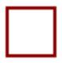

# VTUI library Programmers Reference

Version 1.0

*Author: Jimmy Dansbo*

**Note that this documentation can change at any point.**

This document describes the **V**ERA **T**ext **U**ser **I**nterface library.

**Table of Contents**

* [Overview](#overview)
* [Loading the library](#loading)
* [Including the library](#including)
* [Initializing the library](#initialization)
* [Registers](#registers)
* [Functions](#functions)
	* [initialize](#function-name-initialize)
	* [screen_set](#function-name-screen_set)
	* [set_bank](#function-name-set_bank)
	* [get_bank](#function-name-get_bank)
	* [set_stride](#function-name-set_stride)
	* [get_stride](#function-name-get_stride)
	* [set_decr](#function-name-set_decr)
	* [get_decr](#function-name-get_decr)
	* [clr_scr](#function-name-clr_scr)
	* [gotoxy](#function-name-gotoxy)
	* [plot_char](#function-name-plot_char)
	* [scan_char](#function-name-scan_char)
	* [hline](#function-name-hline)
	* [vline](#function-name-vline)
	* [print_str](#function-name-print_str)
	* [input_str](#function-name-input_str)
	* [fill_box](#function-name-fill_box)
	* [pet2scr](#function-name-pet2scr)
	* [scr2pet](#function-name-scr2pet)
	* [border](#function-name-border)
	* [save_rect](#function-name-save_rect)
	* [rest_rect](#function-name-rest_rect)

## Overview

The VTUI library is meant to provide a set of functions for creating Text User Interfaces using
VERA in the Commander X16 computer.

The library is meant to be compiled with Acme into a binary by it self and loaded by the users
program. The choice of compiler/assembler for the user program is entirely up to the user as long as it is possible to store values to zeropage and in registers before calling subroutines. This should make it possible to use the VTUI library from any assembler, C compiler or other programming language which makes it possible to set CPU registers.

For examples, look at the exampleXX.asm files

Include files are provided for the ACME and CA65 assembler, but all they do, is load the binary file
and provide the routine names as both functions and macros although the macros just call the subroutines.
A cc65 header file and wrapper has recently been developed to ease support in cc65 projects.

## Loading

The VTUI library is designed to be loaded by standard CBM kernal functions [SETLFS](https://cx16.dk/c64-kernal-routines/setlfs.html), [SETNAM](https://cx16.dk/c64-kernal-routines/setnam.html) and [LOAD](https://cx16.dk/c64-kernal-routines/load.html).

In several assemblers it is possible to load a binary file directly with the sourcecode. for ACME it is done something like this `VTUI !BIN "VTUI1.0.BIN"` and for CA65 it would be done like this `VTUI .INCBIN "VTUI1.0.BIN"`. The ACME and CA65 include files use this method to load the library.

If an assembler is used to include the binary file, be aware that the first two bytes are a loading address so base address of the actual library will be: `VTUILIB=VTUI+2`.

When using the CBM kernal functions to load the library, the LOAD command will remove the first two bytes before writing the library to memory.

When the library is loaded and VTUILIB is pointing to the memory address where the library starts (load address + 2 if loaded by assembler, otherwise just load address) it needs to be initalized by calling the initialization subroutine at VTUILIB address. All functions of the library are called by reference to the base VTUILIB address.

The cc65 wrapper includes a function to load the library to any memory address. Remember to call the initialize function after the library has been loaded.

## Including

Include files are provided for the ACME and the CA65 assemblers. Obviously it is not necessary to to load the library separately if it is included. The include files takes care of loading and initializing the library and providing function and macro names.

One advantage of using include files instead of the generic library is that the include files provide constants for the 16 default colors, constants for VERA addresses and names for the zeropage registers used by the library.

In the include files, all functions are provided both as macros and routines. All macro names are all upper case and all start with VTUI_ followed by the function name. Functionas are all lower case, start with vtui_ followed by the function name. - Note that all macros just contain a call to the subroutine.

Example: `VTUI_GOTOXY` is the macro name and `vtui_gotoxy` is the function name.

For examples look at acme-exXX.asm or ca65-exXX.asm file(s)

For inclusion in cc65 projects, make sure to include `vtuilib-cc65.h`. Have a look at the `build.sh` script to see how to assemble the library and link it to your own cc65 project. `cc65-ex01.c` should be a fairly comprehensive example on how to use the VTUI library in a cc65 project. Calling conventions can be found in `vtuilib-cc65.h`, but the actual functionality of the functions is still best described in this document.

## Initialization

As the VTUI library is built without knowledge of where in memory it will be loaded, it is
necessary to initialize the library before use. The initialization ensures that the jumptable at the beginning of the library is updated to point to the correct address where functions are loaded.

After initialization, all functions can be called by referencing the base address of the library `VTUILIB`

## Registers

Several zeropage addresses are used by the library for temporary storage space as well as parameter passing. Addresses used are `r0 - r12` (`$02 - $1B`). These are the same registers as are used by the new
kernal functions in the Commander X16.

The VTUI library mostly uses r0, r1l and r2l for parameter passing, r0-r12 are also used for temporary storage and addresses to subroutines. All zeropage registers can be discarded as soon as a routine has returned.

In addition to the zeropage memory, the VTUI library uses CPU registers for transferring arguments to the functions as well as temporary space and indexing.

## Functions

### Function name: initialize
Purpose: Initialize jump table in preparation for library use. 
Call address: `VTUILIB + 0` 
Macro name: none 
Routine name: none 
Communication registers: none 
Preparatory routines: none 
Registers affected: .A, .X & .Y 
ZP registers affected: r0, r1, r2 & r3 ($02-$09) 

**Description:** The routine, initialize, writes a very small subroutine in zeropage memory $02-$09 and calls it to get the return address off of the stack. This is the way the library figures out the correct addresses and updates the builtin jumptable.

### Function name: screen_set
Purpose: Set the screen mode to supported mode 
Call address: `VTUILIB+2` 
Macro name: `VTUI_SCREEN_SET` 
Routine name: `vtui_screen_set` 
Communication registers: .A & .C 
Preparatory routines: none 
Registers affected: .A, .X & .Y 
ZP registers affected: none 

**Description** This function sets the screenmode. Supported modes are:
| Mode | Description |
|------|-------------|
|  $00 | 80x60 text  |
|  $01 | 80x30 text  |
|  $02 | 40x60 text  |
|  $03 | 40x30 text  |
|  $04 | 40x15 text  |
|  $05 | 20x30 text  |
|  $06 | 20x15 text  |
|  $FF | Swap 0 & 3  |

Unsupported modes will fail with .C set.

|Registers | Purpose               |
|------|-----------------------|
|  .A  | Screen mode |

## Function name: set_bank
Purpose: Set the VERA bank to 0 or 1 
Call address: `VTUILIB+5` 
Macro name: `VTUI_SET_BANK` 
Routine name: `vtui_set_bank` 
Communication registers: .C 
Preparatory routines: none 
Registers affected: .A 
ZP registers affected: none 

**Description** Set the VERA bank (high address bit). The value in .C can be either 0 or 1.

|Registers | Purpose               |
|------|-----------------------|
|  .C  | Single bit bank number (0 or 1) |

## Function name: get_bank
Purpose: Get the current VERA bank 
Call address: `VTUILIB+53` 
Macro name: `VTUI_GET_BANK` 
Routine name: `vtui_get_bank` 
Communication registers: .C 
Preparatory routines: none 
Registers affected: .A 
ZP registers affected: none 

**Description** Get the current VERA bank (high address bit). The value will be returned in .C either 0 or 1.

|Registers | Purpose    |
|------|------------|
|  .C  | Single bit bank number (0 or 1) |

## Function name: set_stride
Purpose: Set the VERA stride value 
Call address: `VTUILIB+8` 
Macro name: `VTUI_SET_STRIDE` 
Routine name: `vtui_set_stride` 
Communication registers: .A 
Preparatory routines: none 
Registers affected: .A 
ZP registers affected: r0l ($02) 

**Description** Set the VERA stride value. Stride is the amount the VERA address is incremented or decremented on each access. Stride is a 4 bit value and the routine will ensure that the number is converted to fit in VERA_ADDR_H. For more information about VERA stride, see the [VERA Documentation](https://github.com/commanderx16/x16-docs/blob/master/VERA%20Programmer's%20Reference.md#video-ram-access) about 'Address Increment'

|Registers | Purpose               |
|------|-----------------------|
|  .A  | 4 bit stride value |

## Function name: get_stride
Purpose: Get the current VERA stride value 
Call address: `VTUILIB+56` 
Macro name: `VTUI_GET_STRIDE` 
Routine name: `vtui_get_stride` 
Communication registers: .A 
Preparatory routines: none 
Registers affected: .A 
ZP registers affected: none 

**Description** Get the current VERA stride value.

|Registers|Purpose|
|------|-------|
|  .A  | 4 bit stride value |

## Function name: set_decr
Purpose: Set the VERA decrement bit 
Call address: `VTUILIB+11` 
Macro name: `VTUI_SET_DECR` 
Routine name: `vtui_set_decr` 
Communication registers: .C 
Preparatory routines: none 
Registers affected: .A 
ZP registers affected: none 

**Description** Set the VERA decrement bit. The decrement bit decides if the stride value is added to- or subtracted from the current VERA address. Carry Clear (.C=0) means increment by stride value. Carry Set (.C=1) means decrement by stride value.

|Registers | Purpose               |
|------|-----------------------|
|  .C  | 0 = Increment, 1 = Decrement |

## Function name: get_decr
Purpose: Get the current VERA decrement bit 
Call address: `VTUILIB+59` 
Macro name: `VTUI_GET_DECR` 
Routine name: `vtui_set_decr` 
Communication registers: .C 
Preparatory routines: none 
Registers affected: .A 
ZP registers affected: none 

**Description** Get the current VERA decrement bit.

| Registers | Purpose |
|------|-------|
|  .C  | 0 = Increment, 1 = Decrement |

## Function name: clr_scr
Purpose: Clear the entire screen with specific character and color. 
Call address: `VTUILIB+14` 
Macro name: `VTUI_CLR_SCR` 
Routine name: `vtui_clr_scr` 
Communication registers: .A & .X 
Preparatory routines: none 
Registers affected: .Y 
ZP registers affected: r1l & r2l 

**Description** Fill the entire screen (maximum 80x60) with the character in .A and the color in .X. The routine is only designed to function with VERA decrement set to 0 and stride set to 1.

| Registers | Purpose    |
|-----------|------------|
|   .A      | Character to use for filling   |
|   .X      | Colorcode to use for each char |

## Function name: gotoxy
Purpose: Set VERA address to point to specific coordinates on screen. 
Call address: `VTUILIB+17` 
Macro name: `VTUI_GOTOXY` 
Routine name: `vtui_gotoxy` 
Communication registers: .A & .Y 
Preparatory routines: none 
Registers affected: none 
ZP registers affected: none 

**Description** Point the VERA address to a specific set of coordinates on screen. This works in both 80x60 mode and 40x30 mode. If the point is outside of visible area and character is plotted, it will not be visible. There is no error handling. .Y is the y-coordinate (0-29/59) and .A is the x-coordinate (0-39/79). This function does not actually display anything on screen.

|Registers | Purpose  |
|------|--------------|
|  .A  | x coordinate |
|  .Y  | y coordinate |

## Function name: plot_char
Purpose: Write a screencode character and possibly color to screen. 
Call address: `VTUILIB+20` 
Macro name: `VTUI_PLOT_CHAR` 
Routine name: `vtui_plot_char` 
Communication registers: .A & .X 
Preparatory routines: gotoxy (optional) 
Registers affected: none 
ZP registers affected: none 

**Description** Write the screencode character in .A to the screen at current address. If VERA increment is set to 2, the value in .X will not be written, essentially letting the character use the color already set in VRAM. If VERA increment is 1, the value in .X will be written as the colorcode. Any other increment value is unsupported. 

|Registers | Purpose               |
|------|-----------------------|
|  .A  | Character to write to screen |
|  .X  | bg-/fg-color to write to screen (if VERA stride=1) |

**VERA screencodes** 
[https://cx16.dk/veratext/verachars.jpg](https://cx16.dk/veratext/verachars.jpg)
 
**VERA colors** 

## Function name: scan_char
Purpose: Read a screencode character and possibly color from screen memory 
Call address: `VTUILIB+23` 
Macro name: `VTUI_SCAN_CHAR` 
Routine name: `vtui_scan_char` 
Communication registers: .A & .X 
Preparatory routines: gotoxy (optional) 
Registers affected: none 
ZP registers affected: none 

**Description** Read the screencode character at current VERA address into .A. If VERA increment is set to 2, colorcode will not be read into .X. If VERA increment is 1, the colorcode will be read into .X. Any other increment value is unsupported. 

|Registers | Purpose               |
|------|-----------------------|
|  .A  | Character read from screen memory |
|  .X  | Colorcode read from screen memory (if VERA stride=1) |

## Function name: hline
Purpose: Draw a horizontal line from left to right. 
Call address: `VTUILIB+26` 
Macro name: `VTUI_HLINE` 
Routine name: `vtui_hline` 
Communication registers: .A, .X & .Y 
Preparatory routines: gotoxy (optional) 
Registers affected: .A 
ZP registers affected: none 

**Description** Draw a horizontal line from left to right, starting at current position. Length of the line is provided in .Y register. Character to use for drawing the line is provided in .A register and the background-/foreground-color to use is provided in .X register. Colorcode in .X is only used if VERA stride is set to 1. When stride is set to 2, the existing color information is not overwritten. Any other stride value is unsupported.

|Registers | Purpose               |
|------|-----------------------|
|  .A  | Character for drawing line |
|  .X  | bg-/fg-color (if VERA stride=1) |
|  .Y  | length of line  |

## Function name: vline
Purpose: Draw a vertical line from top to bottom. 
Call address: `VTUILIB+29` 
Macro name: `VTUI_VLINE` 
Routine name: `vtui_vline` 
Communication registers: .A, .X & .Y 
Preparatory routines: gotoxy (optional) 
Registers affected: .A 
ZP registers affected: none 

**Description** Draw a vertical line from top to bottom, starting at current position. Height of the line is provided in .Y register. Character to use for drawing the line is provided in .A and the background-/foreground-color to use is provided in .X register. Colorcode in .X is only used if VERA stride is set to 1. When stride is set to 2, the existing color information is not overwritten. Any other stride value is unsupported.

|Registers | Purpose               |
|------|-----------------------|
|  .A  | Character for drawing line |
|  .X  | bg-/fg-color (if VERA stride=1) |
|  .Y  | Height of line  |

## Function name: print_str
Purpose: Print a string to screen. 
Call address: `VTUILIB+32` 
Macro name: `VTUI_PRINT_STR` 
Routine name: `vtui_print_str` 
Communication registers: r0 ($02-$03), .A, .X & .Y 
Preparatory routines: gotoxy (optional) 
Registers affected: .A & .Y 
ZP registers affected: r7 & r8l ($10-12) & r11h & r12 ($19-$1B) 

**Description** Print string of .Y length to screen. If .A=0, The routine will convert PETSCII characters in the range $20-$5F. Other characters will be converted to a large X-like character. If .A is set to $80, no conversion will take place. r0 ($02 & $03) is a 16bit zeropage pointer to the string. Background-/foreground color for the string is provided in .X register if VERA stride value is 1. If stride is set to 2, the color information in VRAM is not changed, essentially allowing the string to be printed with the color information already stored in VRAM. Any other stride value is unsupported.

|Registers | Purpose               |
|------|-----------------------|
|  .A  | Convert string (0 = convert, $80 = no conversion) |
|  .X  | bg-/fg-color (if VERA stride=1)|
|  .Y  | Length of string |
|  r0  | Pointer to start of string |

## Function name: input_str
Purpose: Read a string of a certain length from keyboard. 
Call address: `VTUILIB+53` 
Macro name: `VTUI_INPUT_STR` 
Routine name: `vtui_input_str` 
Communication registers: r0 ($02-$03), .A, .X & .Y 
Preparatory routines: gotoxy (optional) 
Registers affected: .A & .Y 
ZP registers affected: r1 ($04-05) 

**Description** Show a cursor and get input from keyboard. The routine supports characters in the range $20-$5F and backspace. Input is written to screen and stored in the buffer at r0. The function does not return until enter/return is pressed. At that time the buffer will contain the entered string as PETSCII and .Y will contain the actual length of the input string.

|Registers | Purpose               |
|------|-----------------------|
|  .X  | bg-/fg-color |
|  .Y  | maximum length of string / Actual length on return |
|  r0  | Pointer to pre-allocated buffer |

## Function name: fill_box
Purpose: Draw a filled box 
Call address: `VTUILIB+35` 
Macro name: `VTUI_FILL_BOX` 
Routine name: `vtui_fill_box` 
Communication registers: r1l ($04), r2l ($06), .A & .X 
Preparatory routines: gotoxy (optional) 
Registers affected: .Y 
ZP registers affected: r2l ($06) 

**Description** Draw a filled box starting at current position. This function only supports a VERA stride value of 1. 

|Registers | Purpose               |
|------|-----------------------|
|  .A  | Character for filling |
| r1l  | Width of box          |
| r2l  | Height of box         |
|  .X  | bg-/fg-color          |

## Function name: pet2scr
Purpose: Convert PETSCII to screencode 
Call address: `VTUILIB+38` 
Macro name: `VTUI_PET2SCR` 
Routine name: `vtui_pet2scr` 
Communication registers: .A 
Preparatory routines: none 
Registers affected: none 
ZP registers affected: none 

**Description** Convert the PETSCII character in .A to screencode. Supported range is $20-$5F. Other characters will be converted to a large X-like character.

|Registers | Purpose               |
|------|-----------------------|
| .A   | Character to convert |

## Function name: scr2pet
Purpose: Convert screencode to PETSCII 
Call address: `VTUILIB+41` 
Macro name: `VTUI_SCR2PET` 
Routine name: `vtui_scr2pet` 
Communication registers: .A 
Preparatory routines: none 
Registers affected: none 
ZP registers affected: none 

**Description** Convert the screencode in .A to PETSCII. Supported range is $00-$3F. Other characters will be converted to a large X-like character.

|Registers | Purpose               |
|------|-----------------------|
| .A   | Character to convert |

## Function name: border
Purpose: Draw a box with border 
Call address: `VTUILIB+44` 
Macro name: `VTUI_BORDER` 
Routine name: `vtui_border` 
Communication registers: .A, .X, r1l ($04) & r2l ($06) 
Preparatory routines: gotoxy (optional) 
Registers affected: .Y
ZP registers affected: r0l ($02), r0h ($03), r3l - r6h ($08 - $0F), r7 - r11l ($10 - $18)

**Description** Create a box with a specific or custom border. Color information is written if VERA stride is set to 1. If stride is set to 2, color information will not be overwritten. All other stride values are unsupported.

Modes 0-5 are pre-defined, only works with the default character set and are shown below. If mode 6 is specified, the border characters can be defined as follows: 

|Register|Address|Border character|
|--------|-------|----------------|
| r3l    | $08   | Top right corner |
| r3h    | $09   | Top left corner |
| r4l    | $0A   | Bottom right corner |
| r4h    | $0B   | Bottom left corner |
| r5l    | $0C   | Top horizontal line character |
| r5h    | $0D   | Bottom horizontal line character |
| r6l    | $0E   | Left vertical line character |
| r6h    | $0F   | Right vertical line character |

***Parameters*** 

|Registers|Purpose     |
|------|---------------|
|  .A  | Border mode   |
| r1l  | Width of box  |
| r2l  | Height of box |
|  .X  | bg-/fg-color (if VERA stride=1) |

***Supported Modes*** 

|Borders| | | | | | | |
|-------|-|-|-|-|-|-|-|
|Mode|0|1|2|3|4|5|6|
|Visual|||||||Custom|

## Function name: save_rect
Purpose: Save an area from the screen to memory 
Call address: `VTUILIB+47` 
Macro name: `VTUI_SAVE_RECT` 
Routine name: `vtui_save_rect` 
Communication registers: .C, .A, r0 ($02-$03), r1l ($04), r2l ($06) 
Preparatory routines: gotoxy (optional) 
Registers affected: .A, .X & .Y
ZP registers affected: r0 ($02-$03), r1h ($05), r2l ($06)

**Description** Save an area from screen to memory. Notice that each character on screen takes up 2 bytes of memory because a byte is used for color information. Function only supports VERA stride value of 1. 

|Register|Purpose|
|--------|-------|
|   .A   |  Destination RAM (0=System RAM, $80=VRAM) |
|   .C   | VRAM bank if .A = $80 |
|   r0   | 16bit destination address |
|   r1l  | Width of area to save |
|   r2l  | Height of area to save |

## Function name: rest_rect
Purpose: Restore an area on screen from memory 
Call address: `VTUILIB+50` 
Macro name: `VTUI_REST_RECT` 
Routine name: `vtui_rest_rect` 
Communication registers: .C, .A, r0 ($02-$03), r1l ($04), r2l ($06) 
Preparatory routines: gotoxy (optional) 
Registers affected: .A, .X & .Y
ZP registers affected: r0 ($02-$03), r1h ($05), r2l ($06)

**Description** Restore an area on screen from memory. Function only supports VERA stride value of 1. 

|Register|Purpose|
|--------|-------|
|   .A   | Source RAM (0=System RAM, $80=VRAM) |
|   .C   | VRAM bank if .A = $80 |
|   r0   | 16bit destination address |
|   r1l  | Width of area to save |
|   r2l  | Height of area to save |
