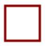

# VTUI library Programmers Reference

Version 0.1

*Author: Jimmy Dansbo*

**This is preliminary documentation and can change at any point.**

This document describes the **Acme** **V**ERA **T**ext **U**ser **I**nterface library.

**Table of Contents**

* [Overview](#overview)
* [Compatibility](#compatibility)
* [Registers](#registers)
* [Functions](#functions)
	* [screen_set](#function-name-screen_set)
	* [clear](#function-name-clear)
	* [set_stride](#function-name-set_stride)
	* [set_decr](#function-name-set_decr)
	* [gotoxy](#function-name-gotoxy)
	* [plot_char](#function-name-plot_char)
	* [scan_char](#function-name-scan_char)
	* [hline](#function-name-hline)
	* [vline](#function-name-vline)
	* [print_str](#function-name-print_str)
	* [fill_box](#function-name-fill_box)
	* [pet2scr](#function-name-pet2scr)
	* [scr2pet](#function-name-scr2pet)
	* [border](#function-name-border)
	* [save_rect](#function-name-save_rect)
	* [rest_rect](#function-name-rest_rect)

## Overview

The VTUI library is meant to provide a set of functions for creating Text User Interfaces using
VERA in the Commander X16 computer. The library is split up into 3 flavors.
* Generic
* ACME include file (the one documented here)
* CA65 include file

The Acme library is meant to be included into the source by the !source or !src pseudo opcode.
The library consists solely of macros and constants for VERA addresses and ZP variables.

For examples, please visit [VTUIlib Acme](VTUIlib-acme/)

The other two flavors are the generic which is a binary file that is loaded separately and the CA65 which is an include file for the CA65 assembler.

## Compatibility

All macros can be called without arguments in which case they will function exactly like the functions in the generic library. See the [VTUI generic](VTUIlib-generic.md) library documentation.

To call functions in the exact same way as with the generic library, each macro should be called from a subroutine like this:

	vtui_gotoxy:
		+VTUI_GOTOXY
		rts

These functions are not included in the Acme library to ensure that the library does not take up any unnecessary space.

## Registers

Several zeropage addresses are used by the library for temporary storage space as well as parameter passing. Addresses used are `$22 - $2D` this is to avoid using the ABI registers used by the new Commander X16 functions.
The ABI registers are named r0, r0l, r0h, r1 and so on. They start at address $02 and go all the way to $21. The debugger in the emulator displays 16bit registers x16, x17, x18 & x19 which start from `$22`. These are the registers mostly used by the VTUI library, but in some cases more space is needed and an additional 4 bytes of zerospace is used totalling 12 bytes of zeropage space used by the library.

The VTUI library only uses the zeropage addresses inside it's own macros or as parameter passing so this space can be used for anything else as long as it is made available to the macros as they are called.

In addition to the zeropage memory, the VTUI library uses CPU registers for transferring arguments to the functions as well as temporary space and indexing.

## Functions

### Function name: screen_set
Purpose: Set the screen mode to supported text mode 
Macro name: `VTUI_SCREEN_SET` 
Parameters:

* .mode = The mode to set

Preparatory routines: none 
Registers affected: .A, .X & .Y 
ZP registers affected: none 

**Description** This macro sets or toggles the screenmode. Supported modes are 0 = 40x30 & 2 80x60. Mode 255 ($FF) will toggle between the two modes. Any other mode will fail silently.

**Example** 

	+VTUI_SCREEN_SET 2 ; Set 80x60 mode.

See also [generic screen_set](VTUIlib-generic.md#function-name-screen_set) for call without parameters
## Function name: clear
Purpose: Clear screen with specific background-/foreground-color 
Macro name: `VTUI_CLEAR` 
Parameters:

* (~).color = Color code used for clearing the screen
	* (\~).bgcolor, (~).fgcolor = Background- and Foreground-color instead of .color

Preparatory routines: none 
Registers affected: .X & .Y 
ZP registers affected: none 

**Description** Clear the screen with specific background-/foreground-color. high-nibble is the background color $0-$F, low-nibble is the foreground color $0-$F. The routine fills the screen with spaces (character $20) and sets each characters color.

**Example** 

	+VTUI_CLEAR $61           ;Clear screen, blue background and white foreground
	+VTUI_CLEAR 6, 1          ; Same as above.
	+VTUI_CLEAR ~my_col       ; Same as above, but using color-value in a variable.
	+VTUI_CLEAR ~my_bg,~my_fg ; Same as above, but using values in variables

	my_col !byte $61
	my_bg  !byte 6
	my_fg  !byte 1

See also [generic clear](VTUIlib-generic.md#function-name-clear) for call without parameters
## Function name: set_stride
Purpose: Set the VERA stride value 
Macro name: `VTUI_SET_STRIDE` 
Parameters:

* (~).stride = stride value

Preparatory routines: none 
Registers affected: .X 
ZP registers affected: none 

**Description** Set the VERA stride value. Stride is the amount the VERA address is incremented or decremented on each access. Stride is a 4 bit value and the routine will ensure that the number is converted to fit in VERA_ADDR_H. For more information about VERA stride, see the [VERA Documentation](https://github.com/commanderx16/x16-docs/blob/master/VERA%20Programmer's%20Reference.md#video-ram-access) about 'Address Increment'

**Example**

	+VTUI_SET_STRIDE 2           ; Increment by 2
	+VTUI_SET_STRIDE ~stride_val ; Same as above, but using variable

	stride_val !byte 2

See also [generic set_stride](VTUIlib-generic.md#function-name-set_stride) for call without parameters
## Function name: set_decr
Purpose: Set the VERA decrement bit 
Macro name: `VTUI_SET_DECR` 
Parameters:

* .decrement = decrement value (0 or 1)

Preparatory routines: none 
Registers affected: .A
ZP registers affected: none 

**Description** Set the VERA decrement bit. The decrement bit decides if the stride value is added to- or subtracted from the current VERA address. Carry Clear (.C=0) or .decrement=0 means increment by stride value. Carry Set (.C=1) or .decrement=1 means decrement by stride value.

**Example**

	+VTUI_SET_DECR 0  ; Increment
	sec
	+VTUI_SET_DECR    ; Decrement (because no parameter, but Carry set)

See also [generic set_decr](VTUIlib-generic.md#function-name-set_decr) for call without parameters
## Function name: gotoxy
Purpose: Set VERA address to point to specific coordinates on screen. 
Macro name: `VTUI_GOTOXY` 
Parameters: 

* (\~).X = X coordinate
* (\~).Y = Y coordinate

Preparatory routines: none 
Registers affected: none 
ZP registers affected: none 

**Description** Point the VERA address to a specific set of coordinates on screen. This works in both 80x60 mode and 40x30 mode. If the point is outside of visible area and character is plotted, it will not be visible. There is no error handling. Y-coordinate (0-29/59) and X-coordinate (0-39/79). This function does not actually display anything on screen.

**Example**

	+VTUI_GOTOXY 15, 2       ; Set VERA memory to point to screen coordinates 15,2
	+VTUI_GOTOXY ~my_x,~my_y ; Same as above, but using variables

	my_x !byte 15
	my_y !byte 2

See also [generic gotoxy](VTUIlib-generic.md#function-name-gotoxy) for call without parameters
## Function name: plot_char
Purpose: Write a screencode character and color to screen. 
Macro name: `VTUI_PLOT_CHAR` 
Parameters:

* (\~).char = Character to write to screen
* (\~).color = Color code used for character
	* (\~).bgcolor, (\~).fgcolor = background-/foreground-colors instead of color code.

Preparatory routines: VTUI_GOTOXY (optional) 
Registers affected: none 
ZP registers affected: none 

**Description** Write the screencode character to the screen at current address. The routine expects VERA to increment by one as it writes the background-/foreground-color to VERA without touching VERA addresses. 
**VERA screencodes** 
 
**VERA colors** 

**Example**

	VERA_A = $01

	+VTUI_PLOT_CHAR VERA_A, $61     ; Write an A with white color on blue background
	+VTUI_PLOT_CHAR VERA_A, 6, 1    ; Same as above, but with colors split up
	+VTUI_PLOT_CHAR ~my_letter, $61 ; Same as above, but char in variable
	+VTUI_PLOT_CHAR VERA_A, ~my_col ; Same as above, but color in variable
	+VTUI_PLOT_CHAR ~my_letter, ~my_bg, ~my_fg ; Everything in variables
	+VTUI_PLOT_CHAR VERA_A		; Just plot letter, don't change color
	+VTUI_PLOT_CHAR ~my_letter      ; Just plot letter, don't change color

	my_letter !byte 2
	my_col    !byte $61
	my_bg     !byte 6
	my_fg     !byte 1

See also [generic plot_char](VTUIlib-generic.md#function-name-plot_char) for call without parameters
## Function name: scan_char
Purpose: Read a screencode character and color from screen memory at current location 
Macro name: `VTUI_SCAN_CHAR` 
Parameters:

* ~.char = Character read
* ~.color = Color code read
* .nocol = Read character into .A, but do not read color code

Preparatory routines: VTUI_GOTOXY (optional) 
Registers affected: none 
ZP registers affected: none 

**Description** Read the screencode character at current VERA address. The routine expects VERA to increment by one as it reads the background-/foreground-color next unless .nocol is set.

**Example**

	+VTUI_SCAN_CHAR ~my_char, ~my_color ; Read character and color into variables
	+VTUI_SCAN_CHAR ~my_char            ; Read only character into variable
	+VTUI_SCAN_CHAR 0                   ; Read only character into .A
	sta my_char

	my_char  !byte 0
	my_color !byte 0

See also [generic scan_char](VTUIlib-generic.md#function-name-scan_char) for call without parameters
## Function name: hline
Purpose: Draw a horizontal line from left to right. 
Macro name: `VTUI_HLINE` 
Parameters:

* (\~).char = Character used to draw line
* (\~).length = Length of the line
* (\~).color = Colorcode used when drawing line
	* (\~).bgcolor,(\~).fgcolor = Colorcode split up

Preparatory routines: VTUI_GOTOXY (optional) 
Registers affected: .A 
ZP registers affected: none 

**Description** Draw a horizontal line from left to right, starting at current position. Color to use can be provided as either the colorcode or the colorcode split up into background and foreground color.

**Example***

	VERA_VERTLINE=$40

	+VTUI_HLINE VERA_VERTLINE, 10, $61 ; Draw a line that is 10 chars long
	+VTUI_HLINE ~my_char, 10, 6, 1     ; Same as above, but char in variable and colors split
	+VTUI_HLINE ~my_char,~my_len, $61  ; Same as above, but char an length in variables

	my_char !byte VERA_VERTLINE
	my_len  !byte 10

See also [generic hline](VTUIlib-generic.md#function-name-hline) for call without parameters
## Function name: vline
Purpose: Draw a vertical line from top to bottom. 
Macro name: `VTUI_VLINE` 
Parameters:

* (\~).char = Character used to draw line
* (\~).height = Height of the line
* (\~).color = Colorcode used when drawing line
	* (\~).bgcolor,(\~).fgcolor = Colorcode split up

Preparatory routines: VTUI_GOTOXY (optional) 
Registers affected: .A 
ZP registers affected: none 

**Description** Draw a vertical line from top to bottom, starting at current position. Color to use can be provided as either the colorcode or the colorcode split up into background and foreground color.

**Example**

	VERA_HORLINE=$40

	+VTUI_HLINE VERA_HORLINE, 10, $61  ; Draw a line that is 10 chars long
	+VTUI_HLINE ~my_char, 10, 6, 1     ; Same as above, but char in variable and colors split
	+VTUI_HLINE ~my_char,~my_len, $61  ; Same as above, but char an length in variables

	my_char !byte VERA_HORLINE
	my_len  !byte 10

See also [generic vline](VTUIlib-generic.md#function-name-vline) for call without parameters
## Function name: print_str
Purpose: Print a string to screen. 
Macro name: `VTUI_PRINT_STR` 
Parameters:

* (\~).addr = Address of beginning of string
* (\~).color = Colorcode used to print the string
	* (\~).bgcolor,(\~).fgcolor = Background- and foreground-color.

Preparatory routines: VTUI_GOTOXY (optional) 
Registers affected: .A & .Y 
ZP registers affected: none 

**Description** Print a 0-terminated PETSCII encoded string to screen. The routine will convert PETSCII characters in the range $20-$59. Other characters will be converted to a large X-like character.

**Example**

	+VTUI_PRINT_STR my_str, $61   ; Print white text on blue background
	+VTUI_PRINT_STR ~my_str, 6, 1 ; Same as above, but colors are split.

	my_str !text "Hello, World!",0

See also [generic print_str](VTUIlib-generic.md#function-name-print_str) for call without parameters
## Function name: fill_box
Purpose: Draw a filled box 
Macro name: `VTUI_FILL_BOX` 
Parameters:

* (\~).char = Character to fill the box with
* (\~).width = Width of the box
* (\~).height= Height of the box
* (\~).color = Colocode used to fill the box
	* (\~).bgcolor, (\~).fgcolor = Background- and foreground-color

Preparatory routines: VERA_GOTOXY (optional) 
Registers affected: .A & .Y 
ZP registers affected: none 

**Description** Draw a filled box starting at current position. 

**Example**

	+VTUI_FILL_BOX ' ', 10, 5, $16        ; Fill a box with white spaces
	+VTUI_FILL_BOX ' ', ~my_w, ~my_h, $16 ; As above, but width and height in variables

	my_w !byte 10
	my_h !byte 5

See also [generic fill_box](VTUIlib-generic.md#function-name-fill_box) for call without parameters
## Function name: pet2scr
Purpose: Convert PETSCII to screencode 
Call address: `VTUILIB+35` 
Communication registers: .A 
Preparatory routines: none 
Registers affected: none 
ZP registers affected: none 

**Description** Convert the PETSCII character in .A to screencode. Supported range is $20-$59. Other characters will be converted to a large X-like character.

## Function name: scr2pet
Purpose: Convert screencode to PETSCII 
Call address: `VTUILIB+38` 
Communication registers: .A 
Preparatory routines: none 
Registers affected: none 
ZP registers affected: none 

**Description** Convert the screencode in .A to PETSCII. Supported range is $00-$39. Other characters will be converted to a large X-like character.

## Function name: border
Purpose: Draw a box with border 
Call address: `VTUILIB+41` 
Communication registers: .A, .X, x17l & x17h 
Preparatory routines: gotoxy (optional) 
Registers affected: .Y
ZP registers affected: x16l, x16h, x18l-x19h + 4 more addresses ($22,$23,$26-$2D)

**Description** Create a box with a specific border. 

|Registers|Purpose     |
|------|---------------|
|  .A  | Border mode   |
| x17l | Width of box  |
| x17h | Height of box |
|  .X  | bg-/fg-color  |

***Supported Modes*** 

|Borders| | | | | | |
|-------|-|-|-|-|-|-|
|Mode|0|1|2|3|4|5|
|Visual|||||||

## Function name: save_rect
Purpose: Save an area from the screen to memory 
Call address: `VTUILIB+44` 
Communication registers: .C, .A, x16, x17l, x17h 
Preparatory routines: gotoxy (optional) 
Registers affected: .A, .X & .Y
ZP registers affected: x16, x17h

**Description** Save an area from screen to memory. Notice that each character on screen takes up 2 bytes of memory because a byte is used for color information. 

|Register|Purpose|
|--------|-------|
|   .C   |  Destination RAM (0=System RAM, 1=VRAM) |
|   .A   | VRAM bank if .C = 1 |
|  x16   | 16bit destination address |
|  x17l  | Width of area to save |
|  X17h  | Height of area to save |

## Function name: rest_rect
Purpose: Restore an area on screen from memory 
Call address: `VTUILIB+47` 
Communication registers: .C, .A, .x16, x17l, x17h 
Preparatory routines: gotoxy (optional) 
Registers affected: .A, .X & .Y
ZP registers affected: x16, x17h

**Description** Restore an area on screen from memory. 

|Register|Purpose|
|--------|-------|
|   .C   |  Destination RAM (0=System RAM, 1=VRAM) |
|   .A   | VRAM bank if .C = 1 |
|  x16   | 16bit destination address |
|  x17l  | Width of area to save |
|  X17h  | Height of area to save |
